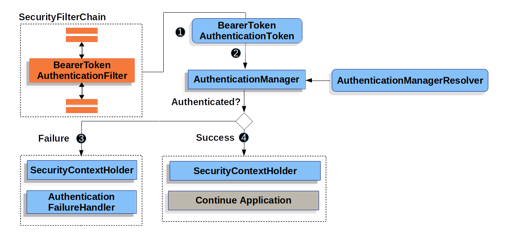

# OAuth 2.0 Resource Server
Spring Security provides comprehensive OAuth 2.0 support. This repository explores OAuth 2.0 resource server creation in a servlet based spring web application.

1. When the user submits their bearer token, the `BearerTokenAuthenticationFilter` creates a `BearerTokenAuthenticationToken` which is a type of `Authentication` by extracting the token from the HttpServletRequest.

2. Next, the HttpServletRequest is passed to the `AuthenticationManagerResolver`, which selects the `AuthenticationManager`. The `BearerTokenAuthenticationToken` is passed into the `AuthenticationManager` to be authenticated.
The `AuthenticationManagerResolver` is set to use two `AuthenticationManager` instances:
   1. Google Oauth2 JWT authentication manager.
   2. Custom JWT authentication manager.

3. If authentication fails, then Failure
   * The `SecurityContextHolder` is cleared out.
   * The `AuthenticationEntryPoint` is invoked to trigger the WWW-Authenticate header to be sent in the response.
   
4. If authentication is successful, then Success.
   * The `Authentication` is set on the `SecurityContextHolder`.
   * The `BearerTokenAuthenticationFilter` invokes `FilterChain.doFilter(request,response)` to continue with the rest of the application logic.
   